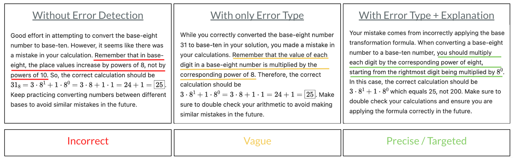

# Intelligent Math Tutor

## Project Description

The Intelligent Math Tutor is designed to address the inefficiencies in traditional mathematics education by providing personalized support and feedback to students. This system leverages advanced AI techniques, including large language models (LLMs), to generate tailored feedback based on individual student solutions, thus aiding in the improvement of their mathematical reasoning skills.

## Key Contributions

### Dataset with Erroneous Math Solutions
- **Real-World Error Reflection:**
  - A custom dataset comprising 152 hand-crafted erroneous math solutions has been developed. These solutions reflect typical mistakes made by students, categorized into logical and concentration errors.
  - Each erroneous solution includes detailed annotations explaining the error type and the specific mistake, enhancing the dataset's utility for training and evaluation.

### Fine-Tuned Models and Prompts
- **Root Cause Analysis:**
  - The project includes fine-tuned models and specialized prompts capable of identifying the root cause of mistakes in student solutions.
  - These models have been fine-tuned using a subset of the custom dataset to accurately distinguish between different types of errors and provide specific feedback.
  
## Feedback Examples



## Models

| Model Name              | Model ID                                      |
|-------------------------|-----------------------------------------------|
| FT10          | `ft:gpt-3.5-turbo-0125:tum-sot-hctl::9VgFsUc6`|
| FT30          | `ft:gpt-3.5-turbo-0125:tum-sot-hctl::9VkmZOnF`|
| FT30E10  | `ft:gpt-3.5-turbo-0125:tum-sot-hctl::9VlDGOVf`|
| **FT10_revised**  | `ft:gpt-3.5-turbo-0125:tum-sot-hctl::9WPLg998`|

## How to Install and Run the Project

### Prerequisites

- Python 3.8 or higher
- pip (Python package installer)
- Git
- Jupyter Notebook

### Installation Steps

1. **Clone the Repository:**
   ```sh
   git clone https://github.com/MathTutor-IDP/tutor.git
   cd tutor
   ```

2. **Install Dependencies:**
   ```sh
   pip install -r requirements.txt
   ```
   
3. **Start jupyter server:**
   ```sh
   jupyter-notebook
   ```
   
4. **Run the notebook you want to test:**
   - Select a notebook and run to start testing.
   

## Contributors

- Emek Gözlüklü
- Emir Gülboy
- Ufuk Yarisan

### Advisors and Supervisors

- Prof. Dr. Enkelejda Kasneci
- Dr. Zilong Zhao

For more details about the project and its development, please refer to the [project presentation](https://drive.google.com/file/d/1XWakE_WND4xWoCvt3XLd6h5Pu4FsgahQ/view?usp=sharing).
